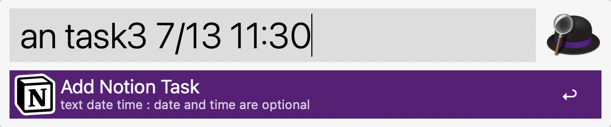
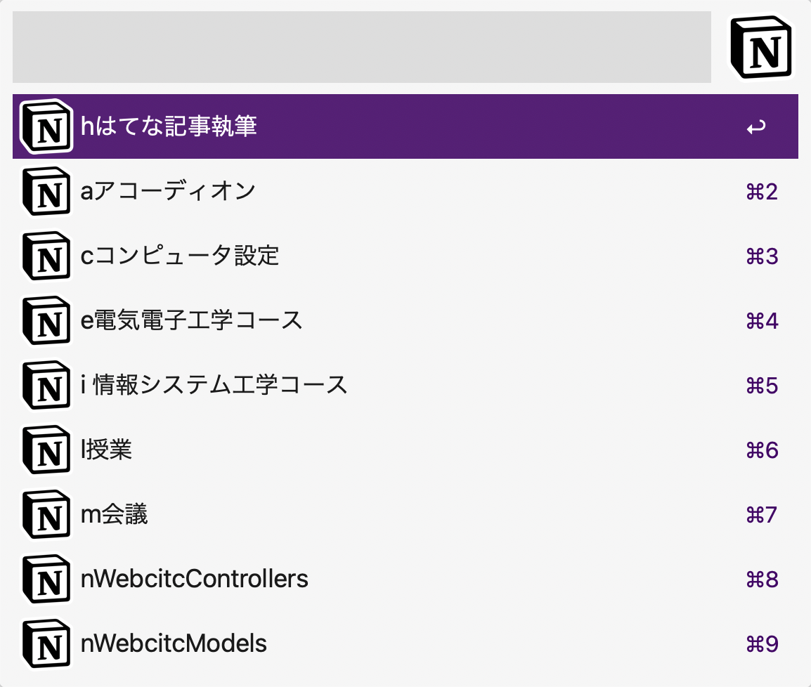
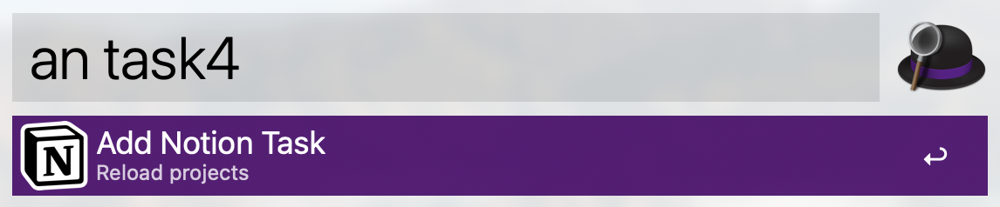
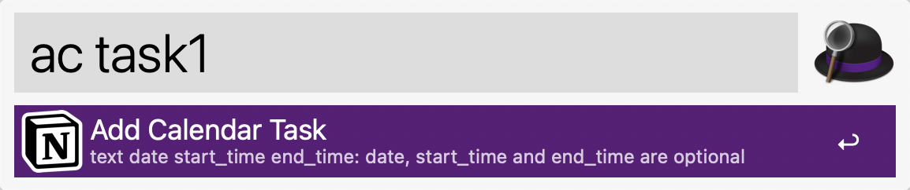
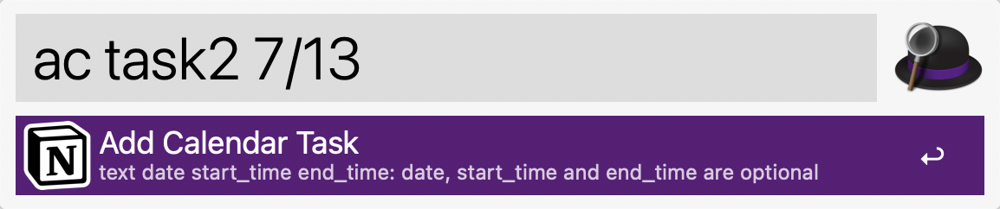
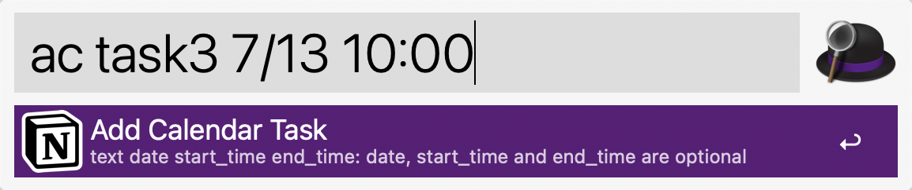
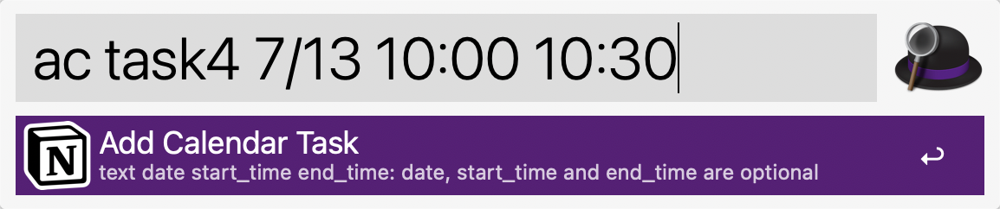
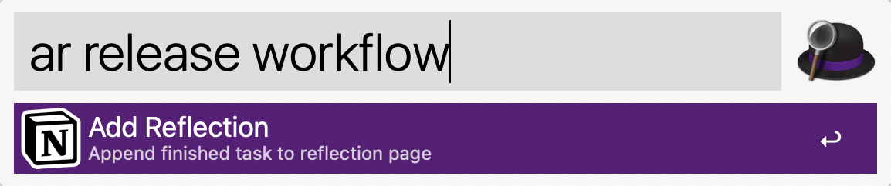
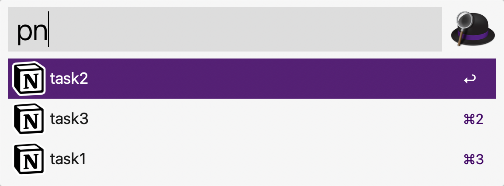
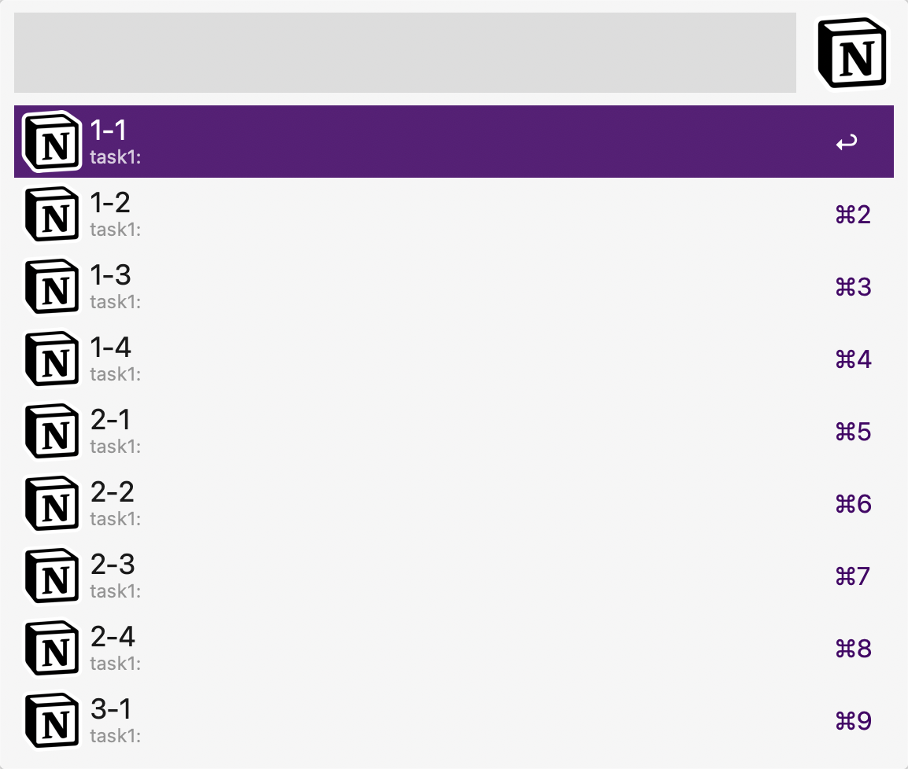

# notion-tools-alfred-workflow
An Alfred workflow to add / change tasks to Notion.so

This workflow uses [OneUpdater](https://github.com/vitorgalvao/alfred-workflows/tree/master/OneUpdater) for automatic version updates.

# Keywords

## an: Add Notion task for a project

Simply type your task name, date and time into Alfred to create a task page to Notion.
The date and time are optional.

Title only|With date|With date and time|
:-:|:-:|:-:
||||

After typing, select a corresponding project from project lists.
The project list was cached into this workflow.
If you want to update the project list, type `shift` + `return` when typing a task name.
|Project selection|Force reload project (shift + return)|
:-:|:-:
|||

## ac: Add calendar event for Notion calendar

Simply type your task name into Alfred to create a task event to Notion calendar.

Title only|With date|With date and start time|With date, start time and end time|
:-:|:-:|:-:|:-:
|||||

## ar: Add a refrection sentence to today's refrection page

Simply type your sentence into Alfred to append the sentence block to a daily refrection page.

## pn: Set pomodoro property to today's tasks

Select an unfinished task from list, and settle a correspond pomodoro period.
Select task|Select pomodoro|
:-:|:-:
|||

# Workflow Variables

- `MY_NOTION_TOKEN`: Your Notion token.
- `TASK_ID`: Database ID for your task database.
- `PROJECT_ID`: Database ID for you project database.
- `MY_TZ`: Your timezone.  Defaults to "+09:00".
- `TASK_DATE`: Date property name for the task.
- `TASK_POMO`: Pomodoro property name for the task.  Do not use Japanese character `ポモ`, because of the NFC-NFD problem.
- `TASK_DONE`: Task finished flag property name for the task.
- `TASK_IS_NOT_POMO`: (Optional) Not pomodoro flag property name for the task.
- `TASK_IS_POMO`: (Optional) Pomodoro flag property name for the task.
- `PROJECT_NAME`: Relation title to Project for the task.  Do not use Japanese character `プロジェクト`, because of the NFC-NFD problem.
- `REFRECTION_TITLE`: Refrection page title.
- `NOTION_CALENDAR`: Calendar name for Notion Calendar.

# Adding the variables to the Alfred workflows

In the Alfred worfklow in the upper right corner click the `[x]` icon and add the values from above to the corresponding value field.

# Download

https://github.com/hkob/notion-tools-alfred-workflow/releases/latest/download/NotionTools.alfredworkflow

