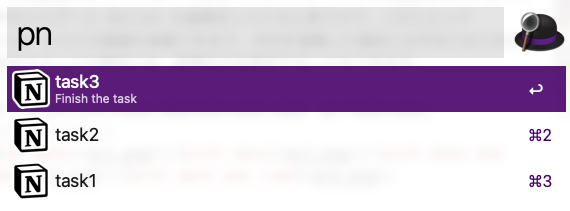
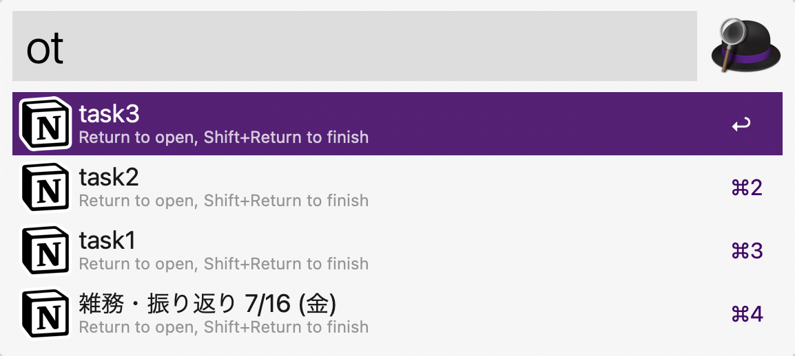
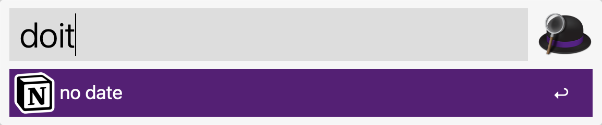
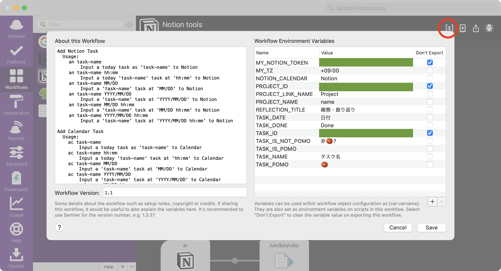
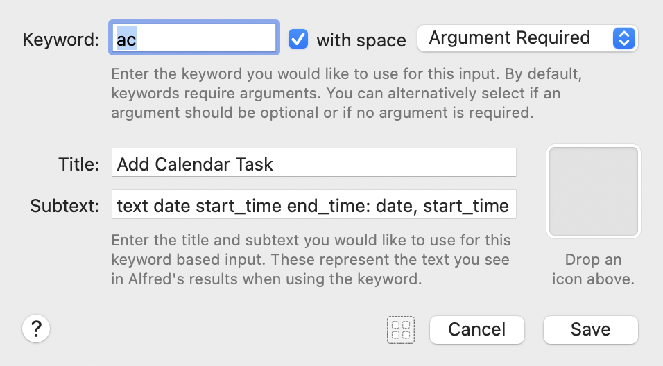

# notion-tools-alfred-workflow

[日本語版 README はこちら](README-ja.md)

An Alfred workflow to add / change tasks to Notion.so

This workflow uses [OneUpdater](https://github.com/vitorgalvao/alfred-workflows/tree/master/OneUpdater) for automatic version updates.

## Keywords

### an: Add Notion task for a project / anc: Add Notion task for a project and set calendar event for Notion calendar

Simply type your task name, date and time into Alfred to create a task page to Notion.
The date and time are optional.
In the case of `anc` command, a calendar event is also registered at the same time.

Title only|With date|With date and start time|With date, start time and end time|
:-:|:-:|:-:|:-:
|||||

After typing, select a corresponding project from project lists.
The project list was cached into this workflow.
If you want to update the project list, type `shift` + `return` when typing a task name.
|Project selection|Force reload project (shift + return)|
:-:|:-:
|||

### ac: Add calendar event for Notion calendar

Simply type your task name into Alfred to create a task event to Notion calendar.

Title only|With date|With date and start time|With date, start time and end time|
:-:|:-:|:-:|:-:
|||||

### ar: Add a reflection sentence to today's reflection page

Simply type your sentence into Alfred to append the sentence block to a daily reflection page.

### pn: Set pomodoro property to today's tasks / finish the task

Select an unfinished task from list, and settle a correspond pomodoro period.

If you want to finish the task, press `Shift` key while selecting.

Select task|Select pomodoro|Finish the task|
:-:|:-:|:-:
|||

### ot: Open an unfinished task / finish the task

If you type only "ot", a list of unfinished tasks will be displayed, so select the task you want to display.
The task opens in the Notion desktop app if the environment variable `OPEN_BY_APP` is set to  `true`, or in the default browser if it is set to `false`.

If you want to finish the task, press `Shift` key while selecting.

### doit: Set today's date to `date` property

If you type only "doit", a list of tasks that don't settled `date` property will be displayed, so select the task you want to do it today.
The selected task will be set to today's date.

## Workflow Variables

- `MY_NOTION_TOKEN`: Your Notion token.
- `TASK_ID`: Database ID for your task database (32-character hexadecimal number).
- `PROJECT_ID`: Database ID for you project database (32-character hexadecimal number).
- `MY_TZ`: Your timezone.  Defaults to "+09:00".
- `TASK_DATE`: Date property name for the task.
- `TASK_POMO`: Pomodoro property name for the task.  Do not use Japanese character `ポモ`, because of the NFC-NFD problem.
- `TASK_DONE`: Task finished flag property name for the task.
- `TASK_IS_NOT_POMO`: (Optional) Not pomodoro flag property name for the task.
- `TASK_IS_POMO`: (Optional) Pomodoro flag property name for the task.
- `PROJECT_NAME`: Title name for Project database.  Do not use Japanese character `プロジェクト`, because of the NFC-NFD problem.
- `PROJECT_LINK_NAME`: Relation title to Project for the task.  Do not use Japanese character `プロジェクト`, because of the NFC-NFD problem.
- `REFLECTION_TITLE`: Reflection page title.
- `NOTION_CALENDAR`: Calendar name for Notion Calendar.
- `OPEN_BY_APP`: `true` to open app, `false` to open browser

## How to use

### Notion setup

In this workflow, two Notion database (Task and Project) are required.
A task page belongs to a project page.
Please check [a sample template](https://www.notion.so/Sample-database-for-notion-tools-alfred-workflow-5b5556f7fec84468ad1e4fe2bdea2db3) for these database.

### Notion API setup

Next, set API setting.  Please see [Getting Started](https://developers.notion.com/docs/getting-started) in the Notion Developer page.
Please remind `MY_NOTION_TOKEN` and database_id for the above two databases (`TASK_ID` and `PROJECT_ID`), and invite your integration to the two databases.

### Set workflow variables

In the Alfred workflow in the upper right corner click the `[x]` icon and add the values from above to the corresponding value field.
Please set the above three parameters, and modify the other environment variables to match the properties of your database.

### Change keyword and icon image (Optional)

You can change the keyword and the image icon in the keyword box.

## Download

[https://github.com/hkob/notion-tools-alfred-workflow/releases/latest/download/Notion.tools.alfredworkflow]
